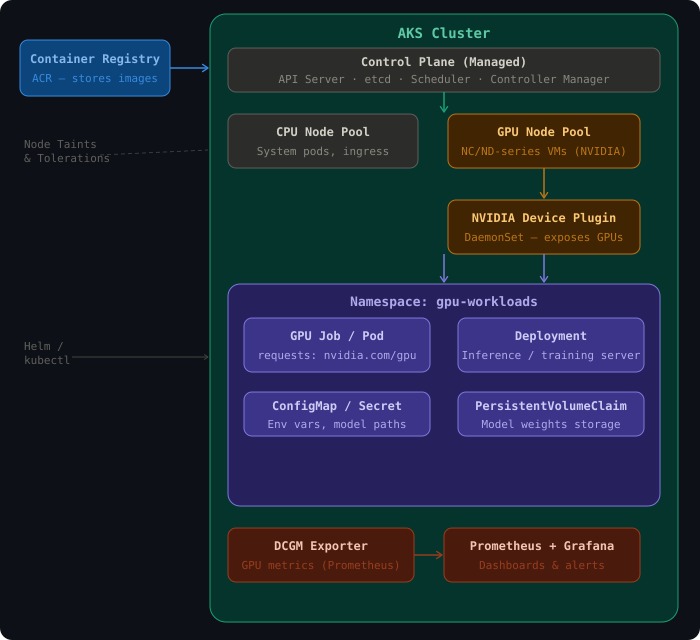

# AKS GPU Workload Deployment Guide

A complete guide to deploying GPU-based workloads on Azure Kubernetes Service (AKS) — from cluster setup to monitoring.

---

## Table of Contents

- [Architecture Overview](#architecture-overview)
- [Prerequisites](#prerequisites)
- [Step 1 — Create AKS Cluster with GPU Node Pool](#step-1--create-aks-cluster-with-gpu-node-pool)
- [Step 2 — Install NVIDIA Device Plugin](#step-2--install-nvidia-device-plugin)
- [Step 3 — Write GPU Pod / Job Manifest](#step-3--write-gpu-pod--job-manifest)
- [Step 4 — Attach Storage for Model Weights](#step-4--attach-storage-for-model-weights)
- [Step 5 — Build & Push Container Image](#step-5--build--push-container-image)
- [Step 6 — Monitor GPU Utilization](#step-6--monitor-gpu-utilization)
- [Interview Talking Points](#interview-talking-points)
- [GPU VM Size Reference](#gpu-vm-size-reference)

---

## Architecture Overview



---

## Prerequisites

- Azure CLI installed and authenticated (`az login`)
- `kubectl` installed
- `helm` installed (for monitoring stack)
- An Azure subscription with GPU quota approved (request via Azure portal if needed)

```bash
# Install kubectl
az aks install-cli

# Verify
az --version
kubectl version --client
helm version
```

---

## Step 1 — Create AKS Cluster with GPU Node Pool

```bash
# 1. Create resource group
az group create --name myRG --location eastus

# 2. Create the AKS cluster (CPU system node pool)
az aks create \
  --resource-group myRG \
  --name myAKSCluster \
  --node-count 1 \
  --node-vm-size Standard_DS2_v2 \
  --generate-ssh-keys

# 3. Add a GPU node pool
az aks nodepool add \
  --resource-group myRG \
  --cluster-name myAKSCluster \
  --name gpunodepool \
  --node-count 1 \
  --node-vm-size Standard_NC6s_v3 \
  --node-taints sku=gpu:NoSchedule \
  --aks-custom-headers UseGPUDedicatedVHD=true

# 4. Get credentials
az aks get-credentials --resource-group myRG --name myAKSCluster

# 5. Verify nodes
kubectl get nodes -o wide
```

> **Note on taints:** `--node-taints sku=gpu:NoSchedule` prevents non-GPU pods from being
> scheduled onto expensive GPU nodes. GPU workloads must declare a matching toleration.

### GPU VM Size Reference

| VM Size | GPU | VRAM | Use Case |
|---|---|---|---|
| `Standard_NC4as_T4_v3` | NVIDIA T4 | 16 GB | Inference (cost-efficient) |
| `Standard_NC6s_v3` | NVIDIA V100 | 16 GB | Training (mid-range) |
| `Standard_NC12s_v3` | 2× NVIDIA V100 | 32 GB | Multi-GPU training |
| `Standard_ND96asr_v4` | 8× NVIDIA A100 | 320 GB | Large model training |

---

## Step 2 — Install NVIDIA Device Plugin

The NVIDIA Device Plugin is a DaemonSet that runs on every GPU node and exposes
`nvidia.com/gpu` as a Kubernetes schedulable resource. Without it, pods cannot
request GPUs.

```bash
# Apply the official NVIDIA device plugin DaemonSet
kubectl apply -f https://raw.githubusercontent.com/NVIDIA/k8s-device-plugin/v0.14.1/nvidia-device-plugin.yml

# Verify GPUs are visible to the cluster
kubectl get nodes -o custom-columns=NAME:.metadata.name,GPU:.status.allocatable."nvidia\.com/gpu"

# Expected output:
# NAME                          GPU
# aks-gpunodepool-12345-vmss0   1
```

---

## Step 3 — Write GPU Pod / Job Manifest

### Namespace

```bash
kubectl create namespace gpu-workloads
```

### GPU Training Job

```yaml
# gpu-job.yaml
apiVersion: batch/v1
kind: Job
metadata:
  name: gpu-training-job
  namespace: gpu-workloads
spec:
  template:
    spec:
      tolerations:
      - key: "sku"
        operator: "Equal"
        value: "gpu"
        effect: "NoSchedule"
      containers:
      - name: trainer
        image: myacr.azurecr.io/my-gpu-app:latest
        resources:
          limits:
            nvidia.com/gpu: 1      # Request 1 GPU
            memory: "16Gi"
            cpu: "4"
          requests:
            nvidia.com/gpu: 1
            memory: "8Gi"
            cpu: "2"
        env:
        - name: MODEL_PATH
          valueFrom:
            configMapKeyRef:
              name: gpu-config
              key: model_path
        volumeMounts:
        - name: model-store
          mountPath: /mnt/models
      volumes:
      - name: model-store
        persistentVolumeClaim:
          claimName: model-pvc
      restartPolicy: Never
  backoffLimit: 2
```

### GPU Inference Deployment

```yaml
# gpu-deployment.yaml
apiVersion: apps/v1
kind: Deployment
metadata:
  name: inference-server
  namespace: gpu-workloads
spec:
  replicas: 1
  selector:
    matchLabels:
      app: inference-server
  template:
    metadata:
      labels:
        app: inference-server
    spec:
      tolerations:
      - key: "sku"
        operator: "Equal"
        value: "gpu"
        effect: "NoSchedule"
      containers:
      - name: inference
        image: myacr.azurecr.io/inference-server:latest
        ports:
        - containerPort: 8080
        resources:
          limits:
            nvidia.com/gpu: 1
            memory: "16Gi"
            cpu: "4"
        volumeMounts:
        - name: model-store
          mountPath: /mnt/models
      volumes:
      - name: model-store
        persistentVolumeClaim:
          claimName: model-pvc
```

```bash
kubectl apply -f gpu-job.yaml
kubectl apply -f gpu-deployment.yaml

# Monitor job status
kubectl get jobs -n gpu-workloads
kubectl logs job/gpu-training-job -n gpu-workloads
```

### ConfigMap

```yaml
# gpu-config.yaml
apiVersion: v1
kind: ConfigMap
metadata:
  name: gpu-config
  namespace: gpu-workloads
data:
  model_path: "/mnt/models/bert-base"
  batch_size: "32"
  epochs: "10"
```

---

## Step 4 — Attach Storage for Model Weights

### Azure Disk (ReadWriteOnce — single pod)

```yaml
# model-pvc.yaml
apiVersion: v1
kind: PersistentVolumeClaim
metadata:
  name: model-pvc
  namespace: gpu-workloads
spec:
  accessModes:
  - ReadWriteOnce
  storageClassName: managed-premium   # SSD-backed Azure Disk
  resources:
    requests:
      storage: 100Gi
```

### Azure Files (ReadWriteMany — multiple pods)

```yaml
apiVersion: v1
kind: PersistentVolumeClaim
metadata:
  name: shared-model-pvc
  namespace: gpu-workloads
spec:
  accessModes:
  - ReadWriteMany
  storageClassName: azurefile-premium
  resources:
    requests:
      storage: 500Gi
```

> Use **Azure Disk** for single training pods (higher IOPS).
> Use **Azure Files** when multiple inference pods need to read the same model weights.
> Use **Azure Blob Storage via BlobFuse CSI** for very large model archives.

```bash
kubectl apply -f model-pvc.yaml
kubectl get pvc -n gpu-workloads
```

---

## Step 5 — Build & Push Container Image

### Dockerfile (CUDA-enabled)

```dockerfile
# Use NVIDIA's official base image (includes CUDA + cuDNN)
FROM nvcr.io/nvidia/pytorch:23.10-py3

WORKDIR /app

COPY requirements.txt .
RUN pip install --no-cache-dir -r requirements.txt

COPY . .

# Expose inference port (if applicable)
EXPOSE 8080

CMD ["python", "train.py"]
```

### Build with Azure Container Registry

```bash
# Create ACR
az acr create --resource-group myRG --name myACR --sku Standard

# Build and push directly via ACR Tasks (no local Docker needed)
az acr build \
  --registry myACR \
  --image my-gpu-app:latest \
  .

# Grant AKS permission to pull from ACR
az aks update \
  --resource-group myRG \
  --name myAKSCluster \
  --attach-acr myACR
```

---

## Step 6 — Monitor GPU Utilization

### Install DCGM Exporter (GPU Metrics)

DCGM (Data Center GPU Manager) exposes hardware-level GPU metrics to Prometheus.

```bash
# Add NVIDIA Helm repo
helm repo add gpu-helm-charts https://nvidia.github.io/dcgm-exporter/helm-charts
helm repo update

# Install DCGM Exporter
helm install dcgm-exporter gpu-helm-charts/dcgm-exporter \
  --namespace gpu-workloads \
  --set serviceMonitor.enabled=true
```

### Install Prometheus + Grafana

```bash
helm repo add prometheus-community https://prometheus-community.github.io/helm-charts
helm repo update

helm install prometheus prometheus-community/kube-prometheus-stack \
  --namespace monitoring \
  --create-namespace

# Access Grafana dashboard (default: admin / prom-operator)
kubectl port-forward svc/prometheus-grafana 3000:80 -n monitoring
```

### Key GPU Metrics to Watch

| Metric | Description |
|---|---|
| `DCGM_FI_DEV_GPU_UTIL` | GPU compute utilization (%) |
| `DCGM_FI_DEV_MEM_COPY_UTIL` | GPU memory bandwidth utilization (%) |
| `DCGM_FI_DEV_FB_USED` | GPU framebuffer memory used (MB) |
| `DCGM_FI_DEV_POWER_USAGE` | GPU power draw (watts) |
| `DCGM_FI_DEV_SM_CLOCK` | Streaming multiprocessor clock (MHz) |

> Import NVIDIA's official Grafana dashboard (ID: **12239**) for a pre-built GPU monitoring view.

---

## Interview Talking Points

When discussing this on your resume, cover these specifically:

**Node isolation**
- Used node taints (`sku=gpu:NoSchedule`) on GPU node pools to prevent non-GPU workloads from consuming costly GPU nodes
- GPU pods declare matching tolerations to opt in

**NVIDIA Device Plugin**
- Kubernetes doesn't natively understand GPUs; the device plugin DaemonSet is what registers and exposes `nvidia.com/gpu` as a schedulable resource per node

**Right VM SKU selection**
- T4 (NC4as_T4_v3) for inference — cost-efficient, good throughput
- V100 / A100 for training — high compute, large VRAM for big models

**Multi-GPU jobs**
- Requesting `nvidia.com/gpu: 4` in resource limits
- Used PyTorch DDP (DistributedDataParallel) or Horovod for distributed training across GPUs

**Cost optimization**
- Spot/low-priority GPU node pools for training jobs (`--priority Spot` in node pool config)
- Cluster Autoscaler configured to scale GPU pool to zero when idle
- GPU node pools set to scale down after training jobs complete

**Storage strategy**
- Azure Disk (managed-premium) for single-pod training (high IOPS)
- Azure Files (azurefile-premium) for shared model weights across multiple inference pods

**Monitoring**
- DCGM Exporter + Prometheus + Grafana stack for real-time GPU utilization, memory, and power metrics
- Set alerts on low GPU utilization to detect idle or misconfigured workloads

---

## Quick Reference Commands

```bash
# Check GPU node capacity
kubectl get nodes -o custom-columns=NAME:.metadata.name,GPU:.status.allocatable."nvidia\.com/gpu"

# Describe GPU pod for scheduling info
kubectl describe pod <pod-name> -n gpu-workloads

# Check GPU usage inside a running pod
kubectl exec -it <pod-name> -n gpu-workloads -- nvidia-smi

# View job logs
kubectl logs job/<job-name> -n gpu-workloads --follow

# Scale GPU node pool
az aks nodepool scale \
  --resource-group myRG \
  --cluster-name myAKSCluster \
  --name gpunodepool \
  --node-count 3

# Delete completed jobs to free resources
kubectl delete job gpu-training-job -n gpu-workloads
```

---

*Generated for AKS GPU workload deployment reference. Tested with AKS 1.28+, NVIDIA device plugin v0.14.1, DCGM Exporter 3.x.*
